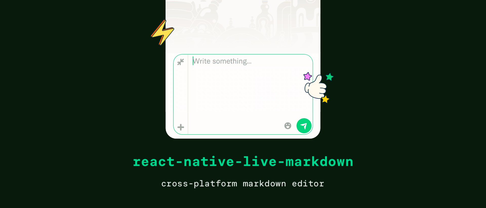

## Features

- ⚛️ Drop-in replacement for `<TextInput>` component
- ⌨️ Live synchronous formatting on every keystroke
- ⚡ Fully native experience (selection, spellcheck, autocomplete)
- 🔧 Customizable logic
- 🎨 Customizable styles
- 🌐 Universal support (Android, iOS, web)
- 🏗️ Supports New Architecture

## Installation

First, install the library from npm with the package manager of your choice:

```sh
yarn add @expensify/react-native-live-markdown react-native-reanimated expensify-common
npm install @expensify/react-native-live-markdown react-native-reanimated expensify-common --save
npx expo install @expensify/react-native-live-markdown react-native-reanimated expensify-common
```

React Native Live Markdown requires [react-native-reanimated](https://github.com/software-mansion/react-native-reanimated) 3.17.0 or newer and [expensify-common](https://github.com/Expensify/expensify-common) 2.0.115 or newer.

Then, install the iOS dependencies with CocoaPods:

```sh
cd ios && bundler install && bundler exec pod install
```

The library includes native code so you will need to re-build the native app.

> [!NOTE]
> The library does not support Expo Go, you will need to setup Expo Dev Client (see [here](https://docs.expo.dev/workflow/prebuild/)).

## Usage

```tsx
import {MarkdownTextInput, parseExpensiMark} from '@expensify/react-native-live-markdown';
import React from 'react';

export default function App() {
  const [text, setText] = React.useState('Hello, *world*!');

  return (
    <MarkdownTextInput
      value={text}
      onChangeText={setText}
      parser={parseExpensiMark}
    />
  );
}
```

## Styling

`MarkdownTextInput` can be styled using `style` prop just like regular `TextInput` component.

It is also possible to customize the styling of the formatted contents of `MarkdownTextInput` component. The style object supports all color representations from React Native including `PlatformColor` and `DynamicColorIOS` according to the [color reference](https://reactnative.dev/docs/colors). Currently, a limited set of styles is customizable but this is subject to change in the future.

```tsx
import type {MarkdownStyle} from '@expensify/react-native-live-markdown';

const FONT_FAMILY_MONOSPACE = Platform.select({
  ios: 'Courier',
  default: 'monospace',
});

const markdownStyle: MarkdownStyle = {
  syntax: {
    color: 'gray',
  },
  link: {
    color: 'blue',
  },
  h1: {
    fontSize: 25,
  },
  emoji: {
    fontSize: 20,
  },
  blockquote: {
    borderColor: 'gray',
    borderWidth: 6,
    marginLeft: 6,
    paddingLeft: 6,
  },
  code: {
    fontFamily: FONT_FAMILY_MONOSPACE,
    fontSize: 20,
    color: 'black',
    backgroundColor: 'lightgray',
  },
  pre: {
    fontFamily: FONT_FAMILY_MONOSPACE,
    fontSize: 20,
    color: 'black',
    backgroundColor: 'lightgray',
  },
  mentionHere: {
    color: 'green',
    backgroundColor: 'lime',
  },
  mentionUser: {
    color: 'blue',
    backgroundColor: 'cyan',
  },
};
```

The style object can be passed to multiple `MarkdownTextInput` components using `markdownStyle` prop:

```tsx
<MarkdownTextInput
  value={text}
  onChangeText={setText}
  style={styles.input}
  markdownStyle={markdownStyle}
/>
```

> [!TIP]
> We recommend to store the style object outside of a component body or memoize the style object with `React.useMemo`.

## Parsing logic

`MarkdownTextInput` behavior can be customized via `parser` property. Parser is a function that accepts a plaintext string and returns an array of `MarkdownRange` objects:

```ts
interface MarkdownRange {
  type: MarkdownType;
  start: number;
  length: number;
  depth?: number;
}
```

Currently, only the following types are supported:

```ts
type MarkdownType = 'bold' | 'italic' | 'strikethrough' | 'emoji' | 'mention-here' | 'mention-user' | 'mention-report' | 'link' | 'code' | 'pre' | 'blockquote' | 'h1' | 'syntax';
```

Parser needs to be marked as a [worklet](https://docs.swmansion.com/react-native-reanimated/docs/guides/worklets/) because it's executed on the UI thread as the user types.

Here's a sample function that parses all substrings located between two asterisks as bold text:

```ts
function parser(input: string) {
  'worklet';

  const ranges = [];
  const regexp = /\*(.*?)\*/g;
  let match;
  while ((match = regexp.exec(input)) !== null) {
    ranges.push({start: match.index, length: 1, type: 'syntax'});
    ranges.push({start: match.index + 1, length: match[1]!.length, type: 'bold'});
    ranges.push({start: match.index + 1 + match[1]!.length, length: 1, type: 'syntax'});
  }
  return ranges;
}
```

> [!TIP]
> We recommend to store the parser function outside of a component body or memoize the parser function with `React.useMemo`.

## Markdown flavors support

Currently, `react-native-live-markdown` supports only [ExpensiMark](https://github.com/Expensify/expensify-common/blob/main/lib/ExpensiMark.ts) flavor. We are working on CommonMark support as well as possibility to use other Markdown parsers.

## API reference

`MarkdownTextInput` inherits all props of React Native's `TextInput` component as well as introduces the following properties:

| Prop            | Type                                 | Default     | Note                                                                                                                                                                                                                   |
| --------------- | ------------------------------------ | ----------- | ---------------------------------------------------------------------------------------------------------------------------------------------------------------------------------------------------------------------- |
| `parser`        | `(value: string) => MarkdownRange[]` | `undefined` | A function that parses the current value and returns an array of ranges.                                                                                                                                               |
| `markdownStyle` | `MarkdownStyle`                      | `undefined` | Adds custom styling to Markdown text. The provided value is merged with default style object. See [Styling](https://github.com/expensify/react-native-live-markdown/blob/main/README.md#styling) for more information. |

## Compatibility

`react-native-live-markdown` supports two latest React Native minor releases.

| react-native | @expensify/react-native-live-markdown |
| :----------: | :-----------------------------------: |
|     0.77     |               0.1.235+                |
|     0.76     |               0.1.141+                |
|     0.75     |               0.1.129+                |
|     0.74     |           0.1.122 – 0.1.128           |
|     0.73     |           0.1.15 – 0.1.121            |

## License

MIT

---

<p align="center">
  <picture>
    <source media="(prefers-color-scheme: light)" srcset="./assets/signature-light.png" />
    <source media="(prefers-color-scheme: dark)" srcset="./assets/signature-dark.png" />
    
  </picture>
</p>
